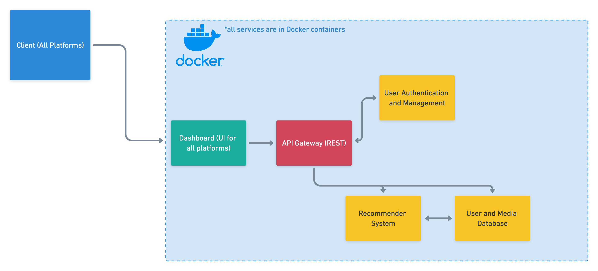
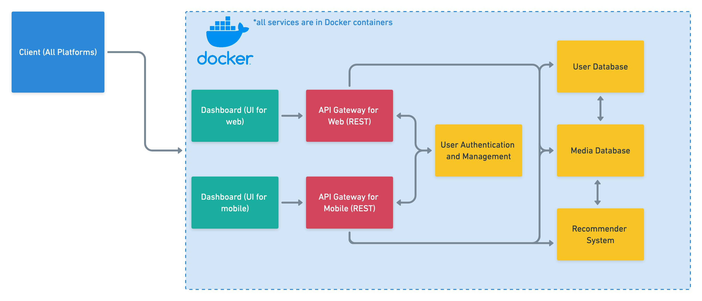

# COMPSCI 497S - Project Milestone 2

- [Presentation](https://docs.google.com/presentation/d/1GpGxDRRR-Ufw7Wyfkvmu4vbhY2Jz-_5Uxgl0CVPAJ-o/edit?usp=sharing)
- Video (coming soon)

# Vision statement

In this day and age, there is an abundance of media and entertainment for most people to consume, like television and films. Our team envisions producing an application that creates personalized recommendations for TV shows and movies to easily allow users to find a suggestion they’ll love to watch, without having to explore or research through the substantial amount of media online. With all that in mind, we hope to accomplish—but are not limited to—these strategic goals: create an accurate recommendation system that caters to users, allow our service to operate on multiple platforms, maintain user privacy and ensure that user data is secure, and ensure user fulfilment. In short, our group believes in making the television and movie search process more convenient, and maintaining and improving user satisfaction.  

# Principles and Practices

## Principles

In order to align with our goals our group set a list of principles. One is to reduce dependencies across services and teams; we hope to make our product mainly bug-free and running at all times and have developers use their preferred technology stack. Another is to have consistent behavior or high cohesion; our team wants to make each of our services have related behavior and reduce the duplication of data and code. We would also like to have easy accessibility between services and deploy a working and accurate application within a reasonable time. Finally, we would like to remain technology-agnostic and utilize reliable 3rd party services.

## Practices

To ensure that our principles are being carried out, we designed a list of practices as well. The first is to use standard REST/HTTP for consistent behavior and to remain technology-agnostic. The next is to use Docker (and potentially Kubernetes) to easily containerize and manage our microservices. For the frontend, we will use React to help save development time with component reusability and simplicity. We will also utilize other services such as TMDb to use as training data for our recommender systems and Google’s Authenticator for user authentication; time will be saved and there is no need to reinvent the wheel. Finally, we will use AWS, a well known and scalable cloud computing service, to host all of our microservices. At the moment we have only listed these principles and practices, but we will add onto or update the list as necessary as our project progresses.

# Prototype Design

Our prototype design for our application can be seen more as a hybrid between a monolithic service and microservices. For convenience and time—as our group is more experienced working in a monolithic-style—we decided to stick with this format. Here is our current structure:

As we can see, a client can connect to our application through the dashboard. Our current user interface was created using React due to its scalability with component reusability. 

Once the client uses something from the interface, a request will be made to our API gateway or routing service. This service uses a REST API in Flask with JSON responses to be technology-agnostic, be consistent and up to date with modern web protocols such as HTTP, have loose coupling, and allow our users to easily understand and access our API. 

Depending on what the client requested, up to three services can be called: user authentication and management, the user and media database, and the recommendation system. The first listed service was created in Node.js and uses Google’s Authentication. We hoped that by using Google, we would allow time to produce a better product as we no longer have to worry about creating our own authentication system. In order to access our databases and recommendation system, a user will need to be authenticated first. 

The next listed service is our database. This was created with PostgreSQL and sample media data was gathered from [GroupLens](https://grouplens.org/datasets/movielens/). Flask was also used to connect and manage the database. We decided to use this technology for its performance, stability and ease of use.   

The last service is our recommendation system. Here, we did not manage to implement it yet so we generated random outcomes from our database. Eventually, we would like to use Flask or any Python library as the recommender will be created in Python. 

Finally, all of our microservices will be containerized with Docker—to avoid breaking changes between services, and easily implement all of our services in our preferred technologies—and hosted on AWS for its pricing, great performance and flexibility. 

Despite our working prototype, our application design can be improved to follow a more standard microservice format. Here is a sample design we can aim—but are not limited to—to follow in the future:

For example, we can split up our media and user database, as our current database violated the principles of integration and shares everything. Another example is using frontends for backends for corresponding services and replacing the API gateway as a central hub into separate API services. As our project progresses, we can potentially alter our current design to follow microservice standards as much as possible. Our group tried to follow our vision, and practices and principles, and keep up with microservice standards as much as possible but we settled with a hybrid approach due to time constraints and our experiences. 