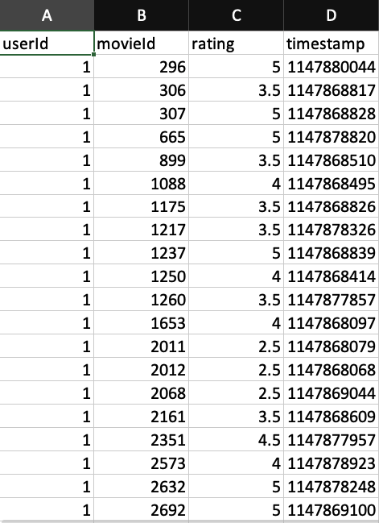

# COMPSCI 497S - Project Milestone 3

- [Video link](https://youtu.be/7BGSWfo_Fas)

- Microservices:
  - [Dashboard](https://github.com/IMDB-2-0/CS497-B/tree/master/services/dashboard): Robin Lovell
  - [API Gateway](https://github.com/IMDB-2-0/CS497-B/tree/master/services/gateway): Hans Quiogue
  - [Recommender](https://github.com/IMDB-2-0/CS497-B/tree/master/services/recommender): Hans Quiogue
  - [Authentication](https://github.com/IMDB-2-0/CS497-B/tree/master/services/auth): Timothy Nguyen
  - [Database and Database API](https://github.com/IMDB-2-0/CS497-B/tree/master/services/database): Eric Trimble
  - [Graph Database](https://github.com/IMDB-2-0/CS497-B/tree/master/services/graph_db): Abhinav Tripathy

## Scalability

Our application has been designed to keep scalability in mind. There are three key ways we accomplish that.
First, we use scalable technologies and languages—such as TypeScript, React, FastAPI, Postgres, and OrientDB—to allow us to scale our application. 
Second, we use NGINX as our web server—which will eventually help with load balancing for incoming requests and resilence with heavy loads through simple configuration files. Third, we use containers that allow for running in isolated, asynchronous and fault tolerant environments. 

That being said, our application still hosts a number of issues. For example, our Recommender System presents the most strain in our service due to the high computation power needed to run models to retrieve movie predictions for users. Our team is currently attempting to figure out ways in which we could make the ETL workflow more efficient—whether that means using a different database to store our data, updating or finetuning our models, changing our machine learning library, and more. 

Another issue we have is with our current database. At the moment, it hosts all of our data such as movies, users, and our mock data we use for training and fitting our recommender system model. With there being millions of entries for our mock data, it might be beneficial for us to split up our database to host our machine learning data seperately from our movies and users. It might not only improve performance and scalability, but it will also help follow the integration principle of not having shared database (Building Microservices by Sam Newman: Chapter 4) 

One last issue we are currently facing is that the build times for our Dashboard service with React takes about 70 seconds to build. While not the biggest concern, it could be troublesome if the service crashed and restarted. It might help if we created multiple interfaces—such as a mobile application or split up our current Dashboard into various fragments somehow—with multiple corresponding backends to have a backends for frontends format. This way, it'll improve scalability by allowing everyone on our team to handle their own service-side components and minimize having centrilized services to rely on. (Building Microservices by Sam Newman: Chapter 4)

Thankfully, in the case in which a service goes down, Docker Compose would bring it back up as defined by the [restart rule](https://docs.docker.com/config/containers/live-restore/) in our Docker Compose file (Docker Documentation). As Docker helps cache our containers, our services can easily be built again and run relatively quickly. Our data will also be kept safe and stored with our Docker volumes.

To enhance overall scalability and fault tolerance, we are in the midst of migrating from Docker Compose to Kubernetes. That would allow us to have duplicate containers, allow for specific memory, CPU or resource allocation and features like auto scaling. We are using a tool called [Kompose](https://kompose.io/) to easily do the migration. 

While we have various scalability issues that need to be resolved, our team is in the progress of mitigating future issues and solving current ones for all of our services. Our final goal by the end of this project is to explore and design scalable systems, alongside the side goal of having a polished and working product.  

## System Design

Our current system is more-or-less similar to our [previous prototype design](https://github.com/IMDB-2-0/CS497-B/blob/master/docs/P2_README.md#prototype-design) with slight changes and additions. Here is our updated and overall architecture:

 

The biggest changes we incorporated include: converting our API Gateway from Flask to NGINX, refactoring our Flask-based recommender system to 
FastAPI and utilizing PySpark for data transformation, and implementing a database API that makes queries to the database and 
returns the data back to other services via HTTP requests. Outside of that everything is essentially the same, but let’s briefly go through our system.

**Docker**

---

Our entire microservice architecture utilizes Docker to containerize all of our services. It is fantastic for scalability as it helps with running all of our services in isolated, asynchronous and fault tolerant environments. 

**Dashboard**

---

We created a dashboard service that users interact with to retrieve their media recommendations. 
It is created in React due to its scalability with component reusability and predictable state management tool with Redux. 
To access the dashboard—and our application as a whole—the client will need to have a Google account and login. 
When the client performs some action on the frontend side, they are essentially sending HTTP request(s) to one or more of our services. 
For our integration technology, we use REST/HTTP with JSON responses to remain technologically-agnostic between services and be consistent with modern web protocols. 

**API Gateway**

---

Our API gateway service intercepts all incoming requests and handles the routing. It is configured through NGINX as a reverse proxy service. 
In short, NGINX proxies all requests to a specified proxied server or service, fetches the response and sends it back to the client. 
Originally we had incorporated a Flask server to handle all of this. But because NGINX is able to do this through a simple set of configurations, 
our group decided to switch over. Alongside that, it is a reliable service—there is no need for us to manually manage everything when 
there is something well known that can already do that. At the moment, we merely use NGINX as a gateway service, 
but eventually, we would like to utilize it’s other features such as load balancing, security, and more.

**Authentication**

---

As stated before, a user will need to have a Google account to use our application. Our authentication service manages that. 
It is built with Express.js as it is a fast and minimal web framework built on the Chrome V8 engine and includes 
convenient authentication middlewares such as Passport.js—user authentication can be easily handled. 
On top of that, we will not have to start from scratch and worry too much about security as we will be utilizing Google 
Authentication, a secure and popular authentication service. This service will provide routes for other services and act 
as a middleman—only users that are authorized will be able to utilize our APIs and application as a whole—and 
call the database API to store public Google profile information if a user is using our service for the first time.

**Database**

---

Our team created a database API in Express.js and a user and media database with PostgreSQL. 
A new change we implemented was adding in mock data to use for training our recommendation engine. 
We used the [MovieLens 25M Dataset](https://grouplens.org/datasets/movielens/), which contains over 25 million movie ratings 
between approximately 162 thousand users between 1995 to 2019. Here is a preview of the dataset we are using to create and fit our recommendation system model with:

  

 

Here is our current schema:

 

As we can see everything is combined into our one database. Eventually, it might benefit us if we either split up our training 
and test data into a new database or not store them with our user and media database; with millions of entries our 
database takes over 10 minutes to initialize! Not to mention we also violate the integration principles with having a shared database. 
We also want to normalize it as much as possible to Boyce Codd normal form (BCNF), add indexes for faster performance going through our data, 
and add cascades to avoid future issues if we ever need to update our schema.

We created an API for the database so that our REST/HTTP integration principle is satisfied, and for high cohesion and loose coupling—outside 
of the recommender system, only the database API has to worry about utilizing SQL queries to the database and all other services just need to utilize HTTP requests to it. 

**Recommender System**

---

Finally, we also have a recommender system that receives training data from our database—specifically user movie ratings—and utilizes 
collaborative filtering (CF) and a matrix factorisation approach—specifically Alternating Least Squares (ALS). 
Essentially, we made these choices for two reasons. One is that CF is a method of recommending items based on past user behavior, 
which is perfect as we have millions of entries for user movie ratings. Second is that ALS is perfect for working with large sparse matrices and 
building and fitting one will help us create accurate recommendations for our users. To do all this, we split up the user movie 
ratings data into training and test sets, fit our ALS model with the training set, and retrieved a fitted model to use for making movie predictions.
We used PySpark—for its machine learning API and compatibility with SQL—and FastAPI—for its support in asynchronous calls, convenient API documentation, 
and compatibility with PySpark being a Python-based framework. At some point if possible, we may want to tune our ALS parameters, 
and fit and compare more models to obtain the most accurate recommendations. We may also want to use Spark Streaming for real time data 
processing and allow faster recommendations to our users.
