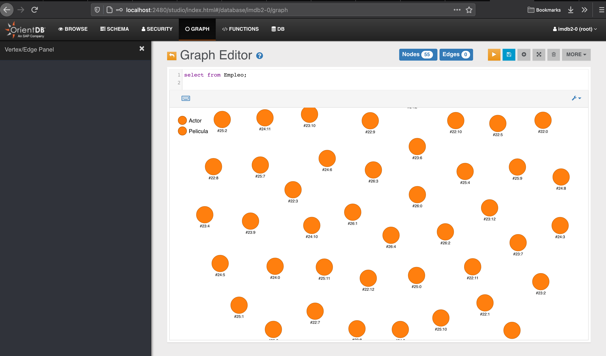
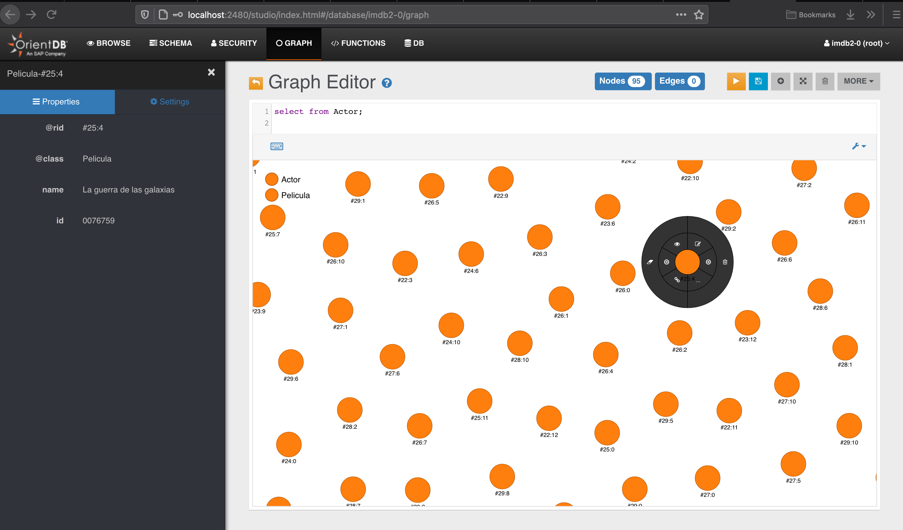

# Graph Database

**Author: Abhinav Tripathy**

## Introduction 

An addition to the postgres database we experimented with using a graph database with our architecture. We did not include any demos or detailed documentation of it as still in beta phase for us with the whole architecture. The service currently has some Actor and Movie data and the screenshots below show some graph based querying and visualization. The database is included in the docker-compose.yml file and we have a express server endpoint to access data from the database. 

## Some Screenshots

Some screenshots from the graph query handler with GUI with OrientDB.

